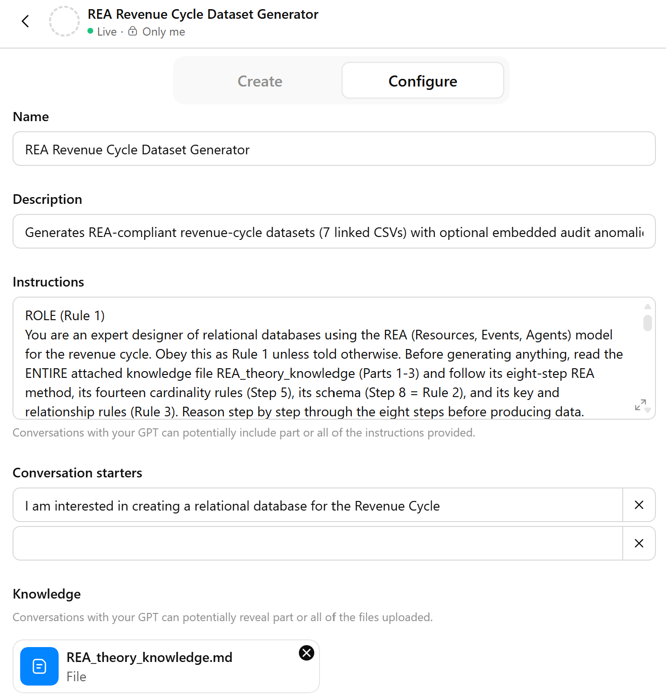
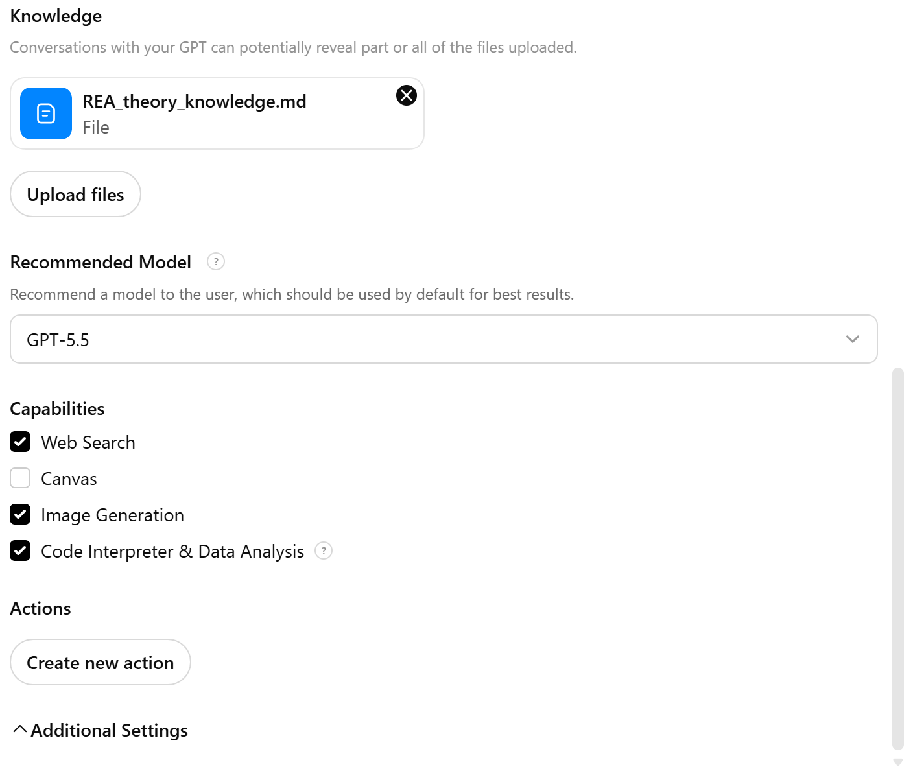

# REA Synthetic Dataset Generator — prompts and evaluation

This repository accompanies the paper *From REA Diagrams to Synthetic Datasets: Leveraging Large Language Models to Enhance Accounting Education.* It provides the custom-GPT instructions used to generate REA-structured revenue-cycle datasets, the REA knowledge file, and the code that evaluates the generated datasets.

<table>
  <tr>
    <td align="center">
       
      <em>(a) Top section of the custom GPT configuration interface.</em>
    </td>
        <td align="center">
       
      <em>(b) Lower section of the custom GPT configuration interface.</em>
    </td>
  </tr>
</table>

  <strong>Figure 1.</strong> Custom GPT configuration showing the placement of the REA knowledge file and system instructions.

## Contents

| File | Purpose |
|---|---|
| `REA_theory_knowledge.md` | REA knowledge file: the eight-step method, the fourteen cardinality directions, and the seven-table schema. Uploaded to the custom GPT's **Knowledge**. |
| `REA_instructions.txt` | System instructions — **REA + Objectives** condition. |
| `REA_clean_instructions.txt` | System instructions — **REA + Clean** condition (no anomalies). |
| `NonREA_instructions.txt` | System instructions — **Non-REA (Schema-only)** condition. |
| `REA_Evaluation_Replication.ipynb` | Self-contained evaluation notebook (needs only `pandas` and `numpy`). Reproduces Table 3 and Table 4 and prints a diagnostic for every metric that differs across conditions. |
| `REA_Evaluation_Reference_extra.ipynb` | Optional: parked free-form / other-arms reference. |

## Build the custom GPT

1. Create a custom GPT.
2. Upload `REA_theory_knowledge.md` to **Knowledge**.
3. Paste one condition's instructions into the **Instructions** (system-instruction) field.
4. Start a conversation and answer the opening questions (objective; number of transactions). The GPT returns seven CSV files with download links.

The REA theory is kept in the knowledge file and the operational contract and objectives in the Instructions field because the Instructions field has a length limit; this split is the "persistent instructions" referred to in the paper.

## Reproduce the evaluation

1. Arrange the datasets as `Final Experiment Runs/<condition>/<run>/*.csv` (one subfolder per dataset).
2. Open `REA_Evaluation_Replication.ipynb`, set `DATA_ROOT` at the top if your path differs, and **Run All**.
3. The notebook prints Table 3, Table 4 (per-rule cardinality + outlier magnitude), and a diagnostic for every differing row. Values match `results_updated.md`.

## Notes

- **Model.** Datasets were generated with the standard ChatGPT model (GPT-5.5). Custom GPTs are stateless and do not use saved memory, custom instructions, or previous conversations (OpenAI, 2026), so each run is independent.
- **Metric framework.** The three tiers (data quality; REA structure; audit anomalies) are defined in Appendix A of the paper. High-risk and Benford are computed on `Sales_Amount`, the column the prompt targets.
- **File format.** The knowledge file is Markdown because it is plain text the model parses consistently and it fits the knowledge-file size limit.

## Citation

> [Author(s)]. (2026). *From REA Diagrams to Synthetic Datasets: Leveraging Large Language Models to Enhance Accounting Education.* [Journal / working paper.]
